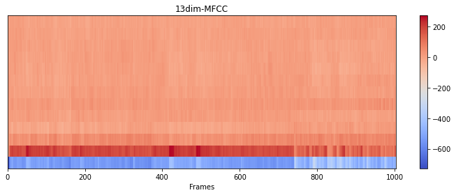
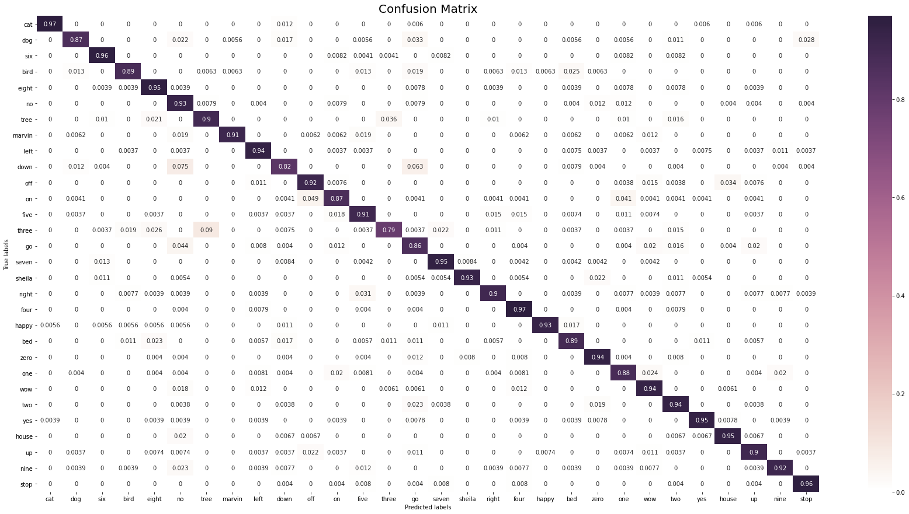

# AI for Sound

The objective of this assignment is to build and deploy a simple Speech to Text deep learning model.

## Model Hyperparameters

* Hidden size - 256
* Mel Frequency Cepstral Coefficients (MFCC) - 12
* Batch size - 16
* Epochs - 5
* Learning rate - 0.001
* Loss function - Cross Entropy Loss (LogSoftmax + NLL Loss)

## Model Architecture

Speech to text model is based on Recurrent Neural network. GRU (Gated Recurrent network) with 2 layers and 256 hidden units has been used. Audio samples have been transformed by Mel Frequency Cepstrum and the derived Mel-frequency cepstral coefficients (MFCCs) are fed to the RNN network.

Model has been trained on Google Launch command dataset, 65K audio samples of one second long utterances of 30 short words. The ASR model is able to detect 30 words. 

### Mel Frequency Cepstral Coefficients (MFCCs)

Mel Frequency Cepstral Coefficents (MFCCs) are a feature widely used in automatic speech and speaker recognition. The Mel scale relates perceived frequency, or pitch, of a pure tone to its actual measured frequency. It is based on a linear cosine transform of a log power spectrum on a nonlinear mel scale of frequency.

## Results

Confusion matrix for the 30 word classification is shared here-

