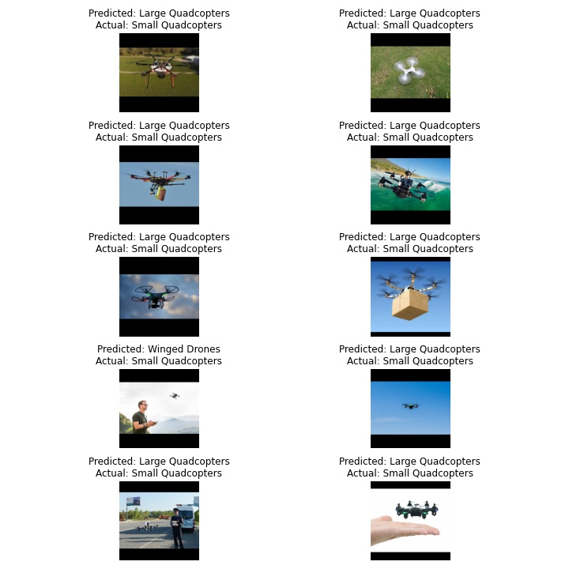

# Training Mobilenet on Custom Drone Dataset

The objective of the CNN model is to train MobileNet v2 on custom dataset of flying obects consisting of small quadcopters, large quadcopters, Winged drones and flying birds. The model is trained by transfer learning. Also, the trained model is deployed on AWS Lambda.

**HIGHLIGHTS:**

- Model: MobilenetV2
- Total no. of parameters: 2,228,996
- Loss: CrossEntropyLoss()
- Optimizer: SGD
- Scheduler: ReduceLROnPlateau
- Final Accuracy: 88.74%
- Batch size: 128
- Epochs: 20 

<h3>Dataset Stats</h3>
There are four different classes of images in the dataset:

<table>
<thead>
  <tr>
    <th>Image Class</th>
    <th>No of Images</th>
    <th>Mean</th>
    <th>Std. Dev</th>
  </tr>
</thead>
<tbody>
  <tr>
    <td>Flying Birds<br></td>
    <td>7781</td>
    <td rowspan="4">[0.3749, 0.4123, 0.4352]</td>
    <td rowspan="4">[0.3326, 0.3393, 0.3740]</td>
  </tr>
  <tr>
    <td>Large QuadCopters</td>
    <td>3609</td>
  </tr>
  <tr>
    <td>Small QuadCopters</td>
    <td>3957</td>
  </tr>
  <tr>
    <td>Winged Drones</td>
    <td>3163</td>
  </tr>
</tbody>
</table>

<h3>Data Preparation</h3>

- The collected dataset had invalid files such as .txt and webpages. The invalid files have been removed. Also, the dataset contained duplicate images which too have been removed. All this data was stored in 4 different .zip files, which were named in a particular format eg: "flying_birds.zip" , "winged_drones.zip".

- The images from each class were then processed, resized and saved in to folders, train and val. The images saved in train and val were shuffeled and splitted in 70:30 ratio for train:val.

- We resized and saved the images beforehand to avoid doing the same operation for each epoch when the data loads and thus saving considerable amount of computation.

- **Resizing Strategy** - The dataset collected contains images of resolution varying from 130x130 pixels to 6000x4000 pixels. We wanted all images to be of size 224 x 224, without losing the aspect ratio. To accomplish this, for each image, the ccomparatively larger dimension (height or width) was resized to 224 and the smaller one was also scaled keeping the aspect ratio constant. After this, we padded the shorted dimension equally on both sides.


![/prepare_drone_dataset.ipynb]

Code for the resize:
```python
def resize_save(im_pth, dst):
    desired_size = 224
    im = cv2.imread(im_pth)
    if type(im) == type(None):
        return
    old_size = im.shape[:2] # old_size is in (height, width) format

    ratio = float(desired_size)/max(old_size)
    new_size = tuple([int(x*ratio) for x in old_size])

    # new_size should be in (width, height) format

    im = cv2.resize(im, (new_size[1], new_size[0]))

    delta_w = desired_size - new_size[1]
    delta_h = desired_size - new_size[0]
    top, bottom = delta_h//2, delta_h-(delta_h//2)
    left, right = delta_w//2, delta_w-(delta_w//2)

    color = [0, 0, 0]
    new_im = cv2.copyMakeBorder(im, top, bottom, left, right, cv2.BORDER_CONSTANT,
        value=color)

    cv2.imwrite(dst, new_im)
```


<h3>Model</h3>

Pre-trained MobileNet v2 model has been considered for this dataset. The pre-trained model is designed for 1000 class predictions. Since, the dataset requires 4 class predictions, the last layer of the model is modified as follows-

```
model = mobilenet_v2(pretrained=True)
model.classifier[1] = nn.Linear(1280, 4)
```

**NOTE:**

Versions of torch and torchvision in colab and AWS Lambda is incompatible. For this reason, model is trained and deployed on torch, torchvision version 1.5.0 and 0.6.0 respectively.

```
!pip install torch==1.5.0 torchvision==0.6.0 -f https://download.pytorch.org/whl/torch_stable.html 
```


<h3>Image Gallery</h3>
1) Misclassified Images of Flying Birds:


2) Misclassified Images of Large QuadCopters:


3) Misclassified Images of Small QuadCopters:



4) Misclassified Images of Winged Drones:


5) Accuracy Curve:


6) Loss Curve:


