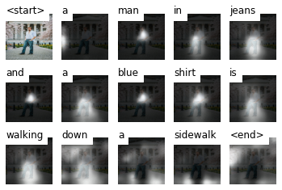

# Image Captioning & Text to Images

The objective of this assignment is to build and deploy a Deep Learning model to generate a descriptive caption for an image.
This implementation is based on *[show, attend and tell](https://arxiv.org/pdf/1502.03044.pdf)* paper.

The code is referenced from this [repository](https://github.com/sgrvinod/a-PyTorch-Tutorial-to-Image-Captioning).

## Model Hyperparameters

* Encoder - ResNet-101 model pretrained on ImageNet dataset.
* Embedding dimension - 512
* Attention dimension - 512
* Decoder dimension - 512
* Dropout - 0.5
* Batch size - 64
* Epochs - 5
* Decoder Learning rate - 4e-4
* Loss - Cross Entropy Loss

## Model Architecture

Image captioning model is based on Encoder-Decoder architecture. Encoder encodes the image into a feature map and the decoder decodes it to generate a sequence. The model uses attention mechanism to help to focus on the part of image which is most releavant for the next word suggestion.

The model has been trained on Flickr 30K dataset.

### Encoder

Pre-trained ResNet 101 model is used as encoder. The last couple of layers (pooling and linear layers) used for classification have been removed. Encoder produces 2048x14x14 feature map. 

### Decoder with attention

LSTM has been used to generate sequence. The Decoder, in a setting with Attention, looks at different parts of the image at different points in the sequence.

Attention is a way for a model to choose only those parts of the encoding that it thinks is relevant to the task at hand.

## Run results

<TABLE>
  <TR>
    <TH>Image</TH>
    <TH>Caption</TH>
  </TR>
   <TR>
      <TD></TD>
      <TD>a man in jeans and a blue shirt is walking down a sidewalk</TD>
   </TR>
  <TR>
      <TD></TD>
      <TD>a man in a blue helmet riding a bike</TD>
   </TR>
</TABLE>

### Caption Visualisation

Visualisation of the caption.

