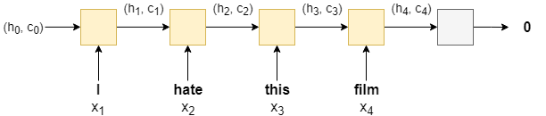

# Neural Word Embeddings

The objective of this assignment is to train a Sentiment Analysis model to estimate whether a given movie review is positive or negative. This NLP model has been trained on IMDB dataset.

The following source has been referred- [Pytorch-Sentiment-Analysis](https://github.com/bentrevett/pytorch-sentiment-analysis).

## Architecture

Since RNN models suffer from vanishing gradient problem, LSTM (Long Short-Term Memory) architecture has been used. LSTMs overcomes the vanishing gradient problem by having an extra recurrent state called a cell, which can be thought of as the "memory" of the LSTM. It uses multiple gates which control the flow of information into and out of the memory.

## Model Hyperparameters

* Batch Size : 64
* Epochs : 5
* Loss function : Binary Cross Entropy Loss
* Optimizer : Adam
* Embedding size : 100

## Results

