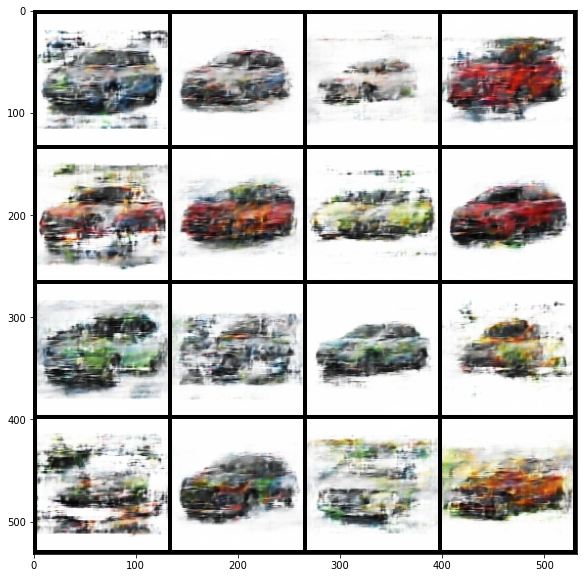
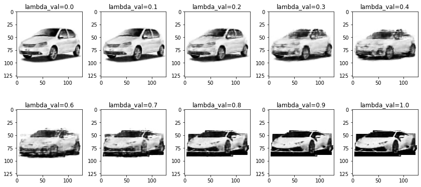

# Variational Auto Encoders

We train a Variational Auto Encoder, to compress and decompress images of cars. The dataset contains the images of cars, collected from the internet. A generic model architecture for a VAE is discussed in the sub section. 

## Model hyperparameters
* Optimizer : Adam
* Loss function : Binary Cross Entropy loss + KL Divergence
* Learning Rate : 1e-3
* Batch size : 128
* Epochs : 700
* Parameters : ~8.7 M

## Model Architecture

A variational autoencoder (VAE) provides a probabilistic manner for describing an observation in latent space. Thus, rather than building an encoder which outputs a single value to describe each latent state attribute,  encoder describes a probability distribution for each latent attribute. This is done by making  encoder not output an encoding vector of size n, rather, outputting two vectors of size n: a vector of means, μ, and another vector of standard deviations, σ.

It consists of two networks:

Encoder network: It translates the original high-dimension input into the latent low-dimensional code. The input size is larger than the output size.

Decoder network: The decoder network recovers the data from the code, likely with larger and larger output layers.

## Results

### Loss curve 

### Model's reconstructed images
Here, we have some images, which were first converted into latent vector by the Encoder and later reconstructed with the help of Decoder.
Original Images

  

VAE reconstrction

### Image generated from random Latent Vector
The output shown are the images generated when we take randomly generated latent vectors and decode it into image. These are not very much resembling cars since the random latent vector is distributed into a large space, where as the model is capable of generating the images from the distribution of the dataset.

### Model's Interpolated images
Here, we take two latent vectorr, generated for two seperate images by the Encoder. We mix the latent vector using the lambda parameter and decode the resultant latent vector into a single image. We see that the intermediate images still resemble cars. This wouldn't have been possible in Auto Encoders.

