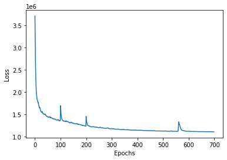
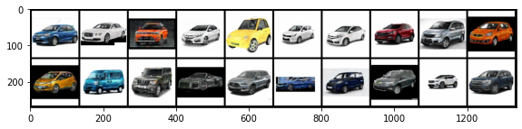

# Variational Auto Encoders

The objective here is to train a Variational Auto Encoders to generate Indian cars. The model generates new cars from pictures of real Indian cars.
Further, the trained model is deployed on AWS Lambda.

## Model hyperparameters
* Optimizer : Adam
* Loss function : Binary Cross Entropy loss + KL Divergence
* Learning Rate : 1e-3
* Batch size : 128
* Epochs : 700
* Parameters : ~8.7 M

## Model Architecture
It consists of two networks:

Encoder network: It translates the original high-dimension input into the latent low-dimensional code. The input size is larger than the output size.

Decoder network: The decoder network recovers the data from the code, likely with larger and larger output layers.

## Loss curve 

## Results
    
